# SISTEM MANAJEMEN INVENTARIS BARANG (E-INVENTORY)

### Identitas Mahasiswa
- Nama : Yuni Hidayani
- NIM : 311910078
- Program Studi : Teknik Informatika
- Mata Kuliah : Pemrograman Web 2
- Dosen Pengampu : Agung Nugroho, M.Kom

#  Deskripsi Proyek

E-Inventory merupakan aplikasi berbasis web yang digunakan untuk mengelola data inventaris barang pada perusahaan. Sistem dibangun menggunakan konsep Decoupled Architecture, yaitu memisahkan Backend REST API dan Frontend Single Page Application (SPA).

#  Fitur Aplikasi

-  Login Administrator
-  Dashboard
-  Manajemen Data Barang
-  Manajemen Kategori Barang
-  Manajemen Supplier
-  Transaksi Barang Masuk
-  Transaksi Barang Keluar
-  Laporan Inventaris
-  Logout

#  Teknologi yang Digunakan

## Backend
- PHP 8
- CodeIgniter 4
- REST API
- MySQL
## Frontend
- VueJS 3
- Vue Router
- Axios
- TailwindCSS

#  Relasi Database
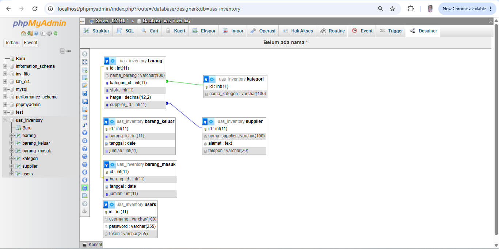

#  Uji API Unauthorized (401)
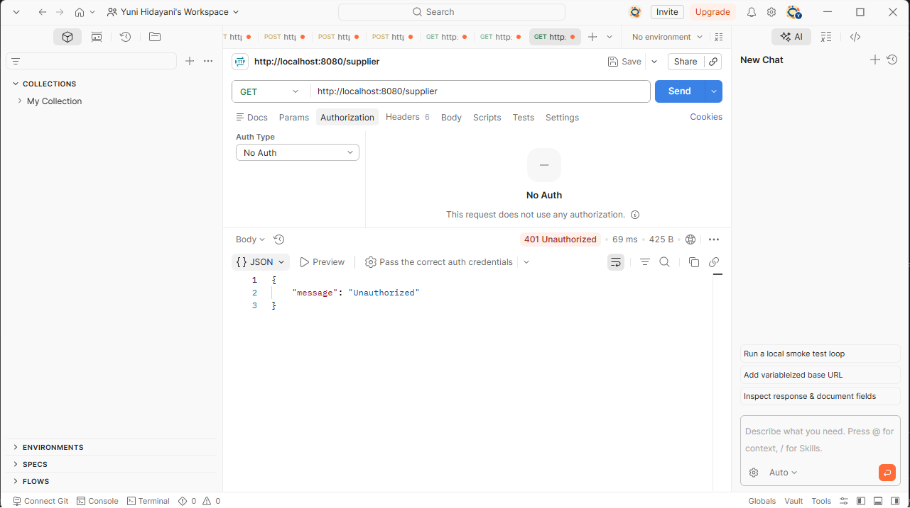

#  Tampilan Aplikasi

## Halaman Home
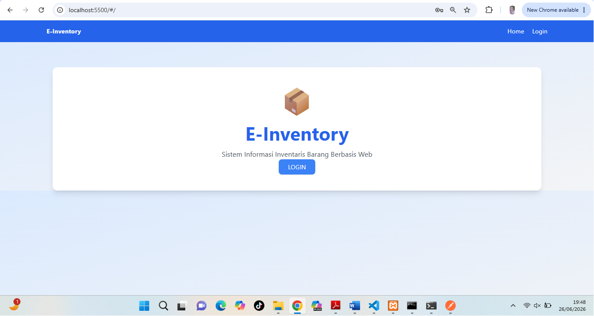

## Halaman Login
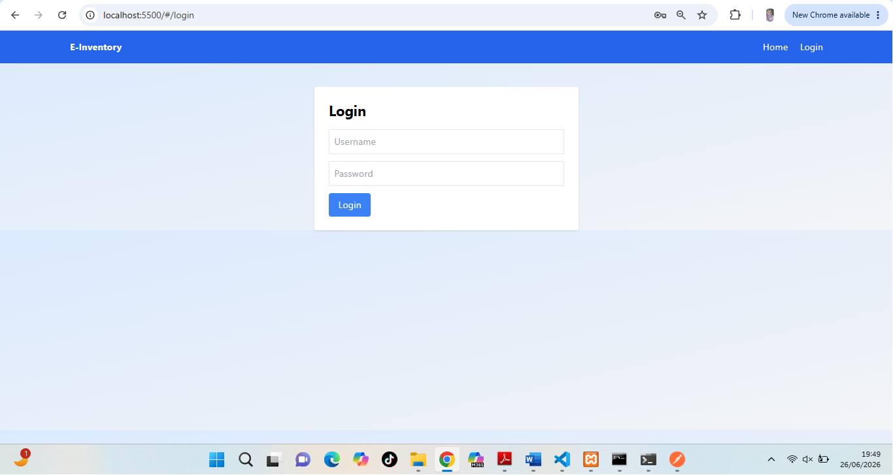

## Dashboard
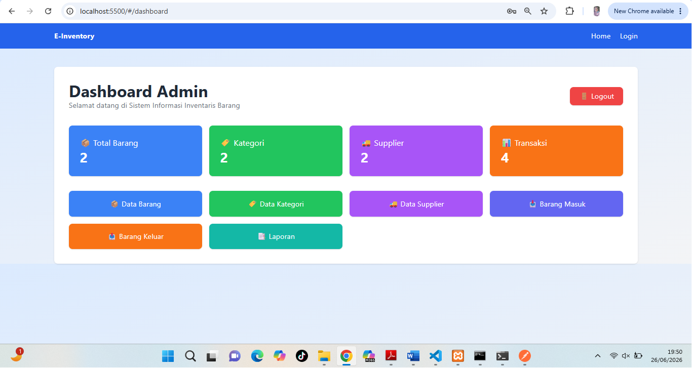

## Data Barang
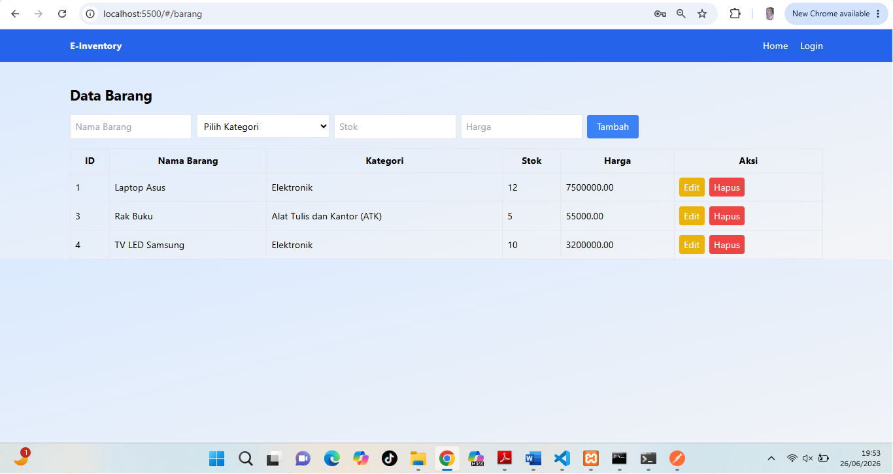

## Data Kategori
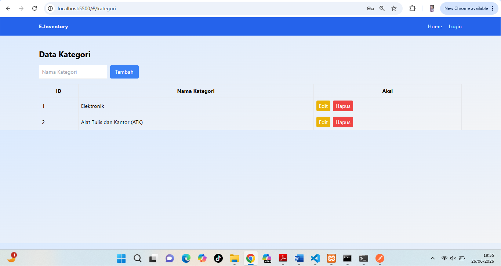

## Data Supplier
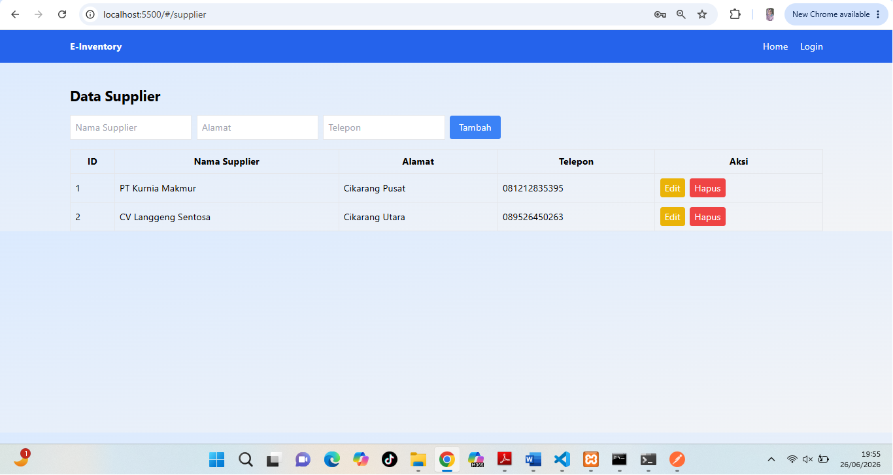

## Barang Masuk
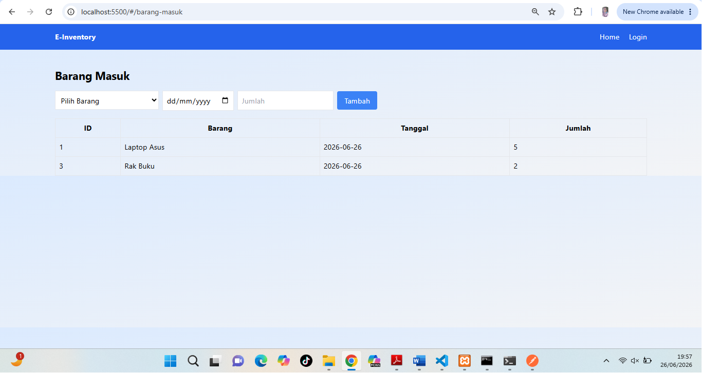

## Barang Keluar
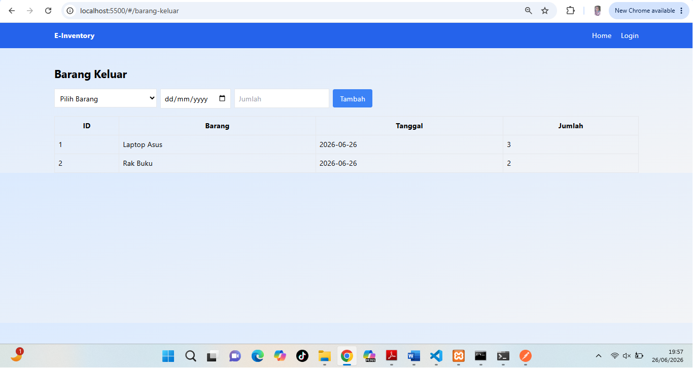

## Laporan
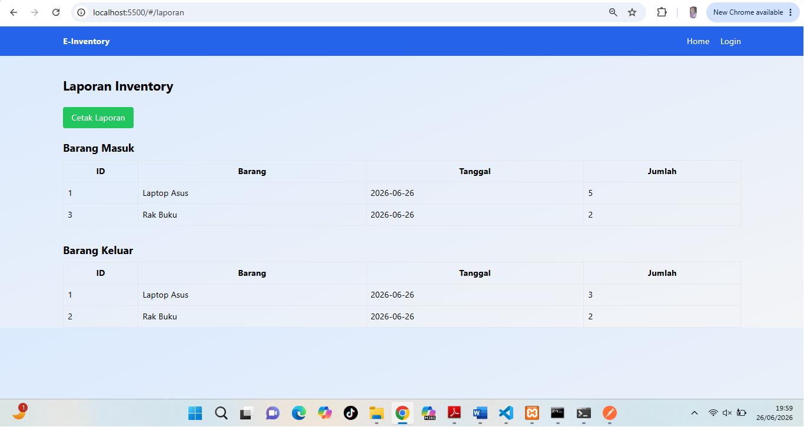

## Cetak Laporan
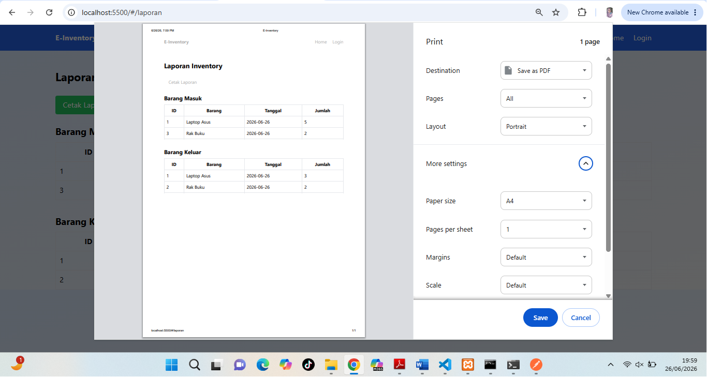

#  Cara Menjalankan Backend

```bash
cd backend-api
composer install
php spark serve
```

Backend berjalan pada:

```text
http://localhost:8080
```

---

#  Cara Menjalankan Frontend

Buka folder `frontend-spa` menggunakan Live Server.

Frontend berjalan pada:

```text
http://localhost:5500
```

# 🔑 Akun Login

Username:
admin

Password:
password


#  Repository GitHub

https://github.com/yunihidayani18/UAS_Web2_311910078_YuniHidayani

---

#  Link Video Presentasi


